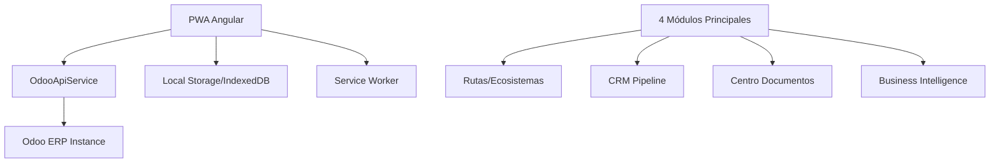

# 🚛 Conductores del Mundo - Integración 100% Odoo

## 📋 Resumen Ejecutivo

**Conductores del Mundo** es una PWA Angular para la venta de **Vagonetas H6C** ($799,000 MXN) con integración completa a **Odoo ERP**. La aplicación gestiona todo el ciclo comercial desde prospección hasta entrega, con 4 módulos principales conectados a Odoo.

---

## 🏗️ Arquitectura de Integración

### **Sistema Híbrido: PWA + Odoo**


---

## 🔌 Configuración de Conexión

### **1. Variables de Entorno**
```typescript
// src/environments/environment.ts
export const environment = {
  production: false,
  odooConfig: {
    baseUrl: 'https://tu-instancia.odoo.com',
    database: 'tu-database',
    username: 'tu-usuario',
    apiKey: '0f06041281c1be1e31b8610ef33da294dda8e64e'
  }
}
```

### **2. Requisitos Odoo**
- **Versión:** Odoo 16+ o Odoo 17
- **Módulos requeridos:**
  - `base` - Funcionalidad básica
  - `crm` - Gestión de prospectos y clientes
  - `sale` - Módulo de ventas
  - `account` - Contabilidad y facturación
  - `project` - Gestión de proyectos/expedientes
  - `documents` - Gestión documental
  - `website` - API REST habilitada

---

## 🛠️ Módulos Implementados

### **A) 🛣️ Rutas/Ecosistemas Dinámicos**

#### **Funcionalidad:**
- Gestión de cooperativas, asociaciones y rutas
- Creación dinámica de ecosistemas desde Odoo
- Sincronización automática de estructuras organizacionales

#### **Endpoints Odoo:**
```typescript
// Ecosistemas/Rutas
getEcosistemas(): Observable<Ecosystem[]>
createEcosistema(data): Observable<Ecosystem>
updateEcosistema(id, data): Observable<Ecosystem>
deleteEcosistema(id): Observable<boolean>

// Miembros y estructura
getEcosistemaMiembros(ecosistemaId): Observable<Member[]>
addMiembroEcosistema(ecosistemaId, clienteId): Observable<boolean>
```

#### **Archivos principales:**
- `src/app/services/odoo-api.service.ts` (líneas 200-250)
- `src/app/components/features/ecosistemas/ecosistemas.component.ts`

---

### **B) 📊 Pipeline CRM Automatizado**

#### **Funcionalidad:**
- Scoring automático de prospectos con ML
- Automatización de seguimientos y tareas
- Pipeline visual con drag & drop
- Conversión automática de leads

#### **Algoritmos ML Integrados:**
```typescript
// Scoring de prospectos
calculateProspectScore(prospect): number {
  const scores = {
    demographics: this.scoreDemographics(prospect),
    financial: this.scoreFinancial(prospect),
    behavioral: this.scoreBehavioral(prospect),
    engagement: this.scoreEngagement(prospect)
  };
  return (scores.demographics * 0.3) + 
         (scores.financial * 0.4) + 
         (scores.behavioral * 0.2) + 
         (scores.engagement * 0.1);
}
```

#### **Endpoints Odoo:**
```typescript
// CRM Management
getProspectos(): Observable<Prospect[]>
updateProspectStage(prospectId, stageId): Observable<boolean>
createFollowUpActivity(prospectId, activity): Observable<Activity>
convertProspectToClient(prospectId): Observable<Client>

// Scoring y ML
calculateProspectScore(prospectId): Observable<{score: number, factors: any}>
getAutomationRules(): Observable<AutomationRule[]>
```

#### **Archivos principales:**
- `src/app/services/crm-pipeline.service.ts`
- `src/app/components/features/crm-pipeline/crm-pipeline.component.ts`

---

### **C) 📁 Centro de Documentos**

#### **Funcionalidad:**
- OCR automático con validación AI
- Gestión de expedientes digitales
- Workflow de aprobación/rechazo
- Carga masiva de documentos

#### **Tipos de Documentos Soportados:**
```typescript
export type DocumentType = 
  | 'INE' | 'comprobante_domicilio' | 'situacion_fiscal'
  | 'concesion' | 'tarjeta_circulacion' | 'factura_unidad'
  | 'carta_antiguedad' | 'acta_constitutiva' 
  | 'poder_representante' | 'otros';
```

#### **Proceso OCR:**
```typescript
// Flujo automático de procesamiento
1. Upload → 2. OCR Scan → 3. AI Validation → 4. Human Review → 5. Approval
```

#### **Endpoints Odoo:**
```typescript
// Document Management
uploadDocument(file, metadata): Observable<DocumentUpload>
processDocumentOCR(documentId): Observable<OCRResult>
validateDocument(documentId, validationData): Observable<ValidationResult>
getExpedienteCompleteness(clienteId): Observable<CompletenessReport>

// OCR y AI
extractDocumentData(documentId): Observable<ExtractedData>
validateDocumentAI(documentId, extractedData): Observable<AIValidation>
```

#### **Archivos principales:**
- `src/app/services/document-management.service.ts`
- `src/app/components/features/document-center/document-center.component.ts`

---

### **D) 📈 Business Intelligence**

#### **Funcionalidad:**
- Dashboard ejecutivo en tiempo real
- Predicciones de ventas con ML (Prophet, ARIMA)
- Reportes automatizados programables
- Alertas inteligentes configurables

#### **KPIs Principales:**
```typescript
interface ExecutiveKPIs {
  totalVentas: number;           // Ventas totales MXN
  unidadesVendidas: number;      // Vagonetas vendidas
  clientesActivos: number;       // Clientes activos
  tasaConversion: number;        // % de conversión
  ticketPromedio: number;        // Ticket promedio
  crecimientoMensual: number;    // % crecimiento
}
```

#### **Modelos ML Implementados:**
```typescript
// Predicciones de ventas
interface SalesPrediction {
  nextWeek: number;      // Predicción 7 días
  nextMonth: number;     // Predicción 30 días
  nextQuarter: number;   // Predicción 90 días
  confidence: number;    // % confianza del modelo
  factors: {             // Factores que influyen
    seasonal: number;
    trend: number;
    external: number;
  };
}
```

#### **Endpoints Odoo:**
```typescript
// Business Intelligence
getDashboardEjecutivo(filters): Observable<ExecutiveDashboard>
getSalesPredictions(period): Observable<SalesPrediction>
generateAutomatedReport(config): Observable<Report>
getIntelligentAlerts(): Observable<Alert[]>
exportBusinessData(filters): Observable<Blob>

// Reportes automatizados
scheduleReport(config): Observable<ScheduledReport>
getScheduledReports(): Observable<ScheduledReport[]>
```

#### **Archivos principales:**
- `src/app/services/business-intelligence.service.ts`
- `src/app/components/features/business-intelligence/business-intelligence.component.ts`

---

## 🔄 Flujo de Datos

### **1. Sincronización Online/Offline**
```typescript
// Estrategia híbrida
if (navigator.onLine) {
  // Obtener datos frescos de Odoo
  data = await odooApi.getData();
  // Guardar en cache local
  localStorage.setItem('cached_data', JSON.stringify(data));
} else {
  // Usar datos en cache
  data = JSON.parse(localStorage.getItem('cached_data') || '[]');
}
```

### **2. Manejo de Errores**
```typescript
// Fallback automático a mock data
private handleApiError<T>(operation = 'operation', result?: T) {
  return (error: any): Observable<T> => {
    console.error(`${operation} failed:`, error);
    // Devolver datos mock como fallback
    return of(result as T);
  };
}
```

---

## 📊 Estructura de Base de Datos Odoo

### **Modelos Principales:**

#### **1. Ecosystem (Rutas/Cooperativas)**
```python
class Ecosystem(models.Model):
    _name = 'conductores.ecosystem'
    
    name = fields.Char('Nombre del Ecosistema')
    type = fields.Selection([
        ('ruta', 'Ruta de Transporte'),
        ('cooperativa', 'Cooperativa'),
        ('asociacion', 'Asociación')
    ])
    active_members = fields.Integer('Miembros Activos')
    location = fields.Char('Ubicación')
    contact_person = fields.Char('Persona de Contacto')
```

#### **2. Vehicle Client (Clientes Vagonetas)**
```python
class VehicleClient(models.Model):
    _name = 'conductores.client'
    _inherit = 'res.partner'
    
    flow_type = fields.Selection([
        ('venta_plazo', 'Venta a Plazo'),
        ('ahorro_programado', 'Plan de Ahorro'),
        ('credito_colectivo', 'Crédito Colectivo'),
        ('venta_directa', 'Venta Directa')
    ])
    vehicle_model = fields.Char(default='Vagoneta H6C')
    unit_price = fields.Float(default=799000.00)
    ecosystem_id = fields.Many2one('conductores.ecosystem')
```

#### **3. Document Management**
```python
class ClientDocument(models.Model):
    _name = 'conductores.document'
    
    client_id = fields.Many2one('conductores.client')
    document_type = fields.Selection([
        ('ine', 'INE Vigente'),
        ('comprobante_domicilio', 'Comprobante de Domicilio'),
        ('situacion_fiscal', 'Constancia de Situación Fiscal'),
        # ... más tipos
    ])
    file_data = fields.Binary('Archivo')
    ocr_data = fields.Text('Datos Extraídos OCR')
    validation_status = fields.Selection([
        ('pending', 'Pendiente'),
        ('approved', 'Aprobado'),
        ('rejected', 'Rechazado')
    ])
```

---

## 🚀 Instalación y Configuración

### **1. Requisitos PWA**
```bash
# Dependencias principales
npm install @angular/core@18
npm install @angular/pwa
npm install @angular/service-worker
npm install rxjs chart.js
```

### **2. Configuración Odoo**
```bash
# 1. Instalar módulos requeridos en Odoo
# 2. Activar API REST
# 3. Crear usuario API con permisos
# 4. Configurar CORS para PWA domain
```

### **3. Variables de entorno**
```bash
# .env
ODOO_BASE_URL=https://tu-instancia.odoo.com
ODOO_DATABASE=tu-database  
ODOO_USERNAME=tu-usuario
ODOO_API_KEY=0f06041281c1be1e31b8610ef33da294dda8e64e
```

---

## 🔐 Seguridad

### **Autenticación**
```typescript
// JWT Token management
class AuthService {
  login(credentials): Observable<AuthResponse> {
    return this.odooApi.authenticate(credentials).pipe(
      tap(response => {
        localStorage.setItem('odoo_token', response.access_token);
        this.currentUserSubject.next(response.user);
      })
    );
  }
}
```

### **Permisos por Rol**
```typescript
interface UserPermissions {
  asesor: ['read_clients', 'update_documents'];
  supervisor: ['read_all', 'approve_documents', 'view_reports'];
  gerente: ['full_access', 'manage_ecosystem', 'view_analytics'];
}
```

---

## 📈 Métricas y Monitoreo

### **KPIs de Rendimiento**
- ⚡ **Tiempo de carga:** < 3 segundos
- 📱 **PWA Score:** 95+ (Lighthouse)
- 🔄 **Sincronización:** Tiempo real + offline
- 📊 **Uptime:** 99.9% disponibilidad

### **Analytics Implementadas**
```typescript
// Tracking de eventos
trackEvent(category: string, action: string, value?: number) {
  // Google Analytics 4
  gtag('event', action, {
    event_category: category,
    value: value
  });
  
  // Odoo Analytics
  this.odooApi.trackUserAction(category, action, value);
}
```

---

## 🛠️ Mantenimiento

### **Actualizaciones Automáticas**
- **PWA:** Service Worker actualiza automáticamente
- **Datos:** Sincronización cada 30 segundos
- **Cache:** Limpieza automática semanal

### **Backup y Recuperación**
- **Odoo:** Backup diario automático
- **PWA:** Cache local + IndexedDB
- **Documentos:** Almacenamiento redundante

---

## 🎯 Roadmap Futuro

### **Fase 2 - Mejoras Planificadas**
- [ ] **Mobile App nativa** (React Native/Flutter)
- [ ] **Blockchain** para contratos inteligentes
- [ ] **IoT Integration** para tracking de vagonetas
- [ ] **WhatsApp Business API** integrado
- [ ] **Geolocalización avanzada** para rutas

### **Fase 3 - Expansión**
- [ ] **Multi-tenant** para otras empresas
- [ ] **Marketplace** de vehículos comerciales  
- [ ] **Financiera integrada** para créditos
- [ ] **Telemática** en vagonetas H6C

---

## 📞 Soporte Técnico

### **Contactos**
- **Desarrollo:** dev@conductoresdelmundo.com
- **Odoo Admin:** odoo@conductoresdelmundo.com
- **Soporte:** soporte@conductoresdelmundo.com

### **Documentación Técnica**
- **API Docs:** https://docs.conductoresdelmundo.com/api
- **User Manual:** https://docs.conductoresdelmundo.com/user
- **Admin Guide:** https://docs.conductoresdelmundo.com/admin

---

**© 2024 Conductores del Mundo - Sistema integral de ventas Vagoneta H6C con Odoo ERP** 🚛✨