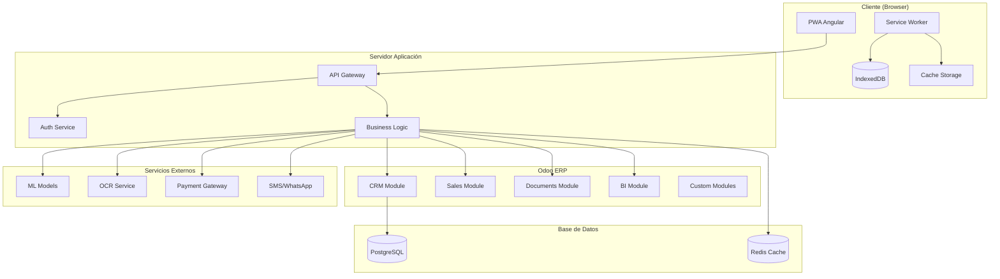
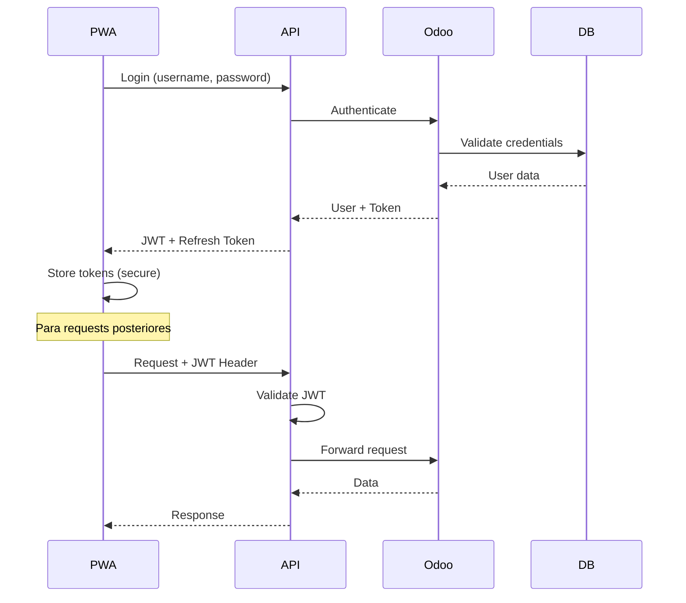

# 🏗️ Arquitectura Técnica - Conductores del Mundo PWA

## 📋 Resumen de la Arquitectura

Sistema híbrido **PWA Angular 18** + **Odoo ERP** para la venta integral de **Vagonetas H6C** con capacidades offline, sincronización en tiempo real y análisis predictivo con ML.

---

## 🎯 Stack Tecnológico

### **Frontend (PWA)**
```typescript
// Tecnologías principales
Angular: 18.2.0          // Framework principal
TypeScript: 5.5.0        // Lenguaje tipado
TailwindCSS: 3.4.0       // Styling
PWA: Angular Service Worker
RxJS: 7.8.0              // Programación reactiva
Signals: Angular 18      // Estado reactivo
Chart.js: 4.4.0          // Visualizaciones
```

### **Backend (Odoo ERP)**
```python
# Stack del servidor
Odoo: 16.0 / 17.0        # ERP Sistema
Python: 3.10+            # Lenguaje backend
PostgreSQL: 14+          # Base de datos
Redis: 6.2+              # Cache y sesiones
Nginx: 1.20+             # Servidor web/proxy
```

### **Infraestructura Cloud**
```yaml
# Servicios en la nube
CDN: CloudFlare           # Distribución global
Storage: AWS S3          # Almacenamiento documentos
ML: AWS SageMaker        # Modelos predictivos
Monitoring: Sentry       # Error tracking
Analytics: GA4           # Métricas de uso
```

---

## 🏛️ Arquitectura de Componentes

### **Diagrama de Alto Nivel**


---

## 🧩 Arquitectura de Módulos PWA

### **Estructura de Directorios**
```
src/app/
├── components/
│   ├── features/           # Componentes de página
│   │   ├── dashboard/
│   │   ├── simulador/
│   │   ├── crm-pipeline/
│   │   ├── document-center/
│   │   ├── business-intelligence/
│   │   └── ...
│   └── shared/            # Componentes reutilizables
│       ├── sidebar/
│       ├── header/
│       └── ui/
├── services/              # Servicios de negocio
│   ├── odoo-api.service.ts
│   ├── crm-pipeline.service.ts
│   ├── document-management.service.ts
│   ├── business-intelligence.service.ts
│   └── ...
├── models/               # Interfaces y tipos
│   ├── types.ts
│   ├── client.model.ts
│   └── ...
├── guards/               # Guards de rutas
├── interceptors/         # HTTP interceptors
└── utils/               # Utilidades y helpers
```

### **Patrón de Arquitectura: Feature-Driven**
```typescript
// Cada feature es autónoma y modular
interface FeatureModule {
  component: FeatureComponent;     // UI Component
  service: FeatureService;         // Business logic
  model: FeatureModel[];          // Data models
  routing: FeatureRouting;        // Routes
}

// Ejemplo: CRM Pipeline Feature
CRMPipelineFeature: {
  component: CrmPipelineComponent,
  service: CrmPipelineService,
  model: [Prospect, Pipeline, AutomationRule],
  routing: '/crm-pipeline'
}
```

---

## 🔄 Flujo de Datos y Estado

### **Gestión de Estado con Signals**
```typescript
// Estado reactivo con Angular Signals
@Injectable({providedIn: 'root'})
export class StateService {
  // Estado global
  private _currentUser = signal<User | null>(null);
  private _isOnline = signal<boolean>(navigator.onLine);
  private _syncQueue = signal<SyncItem[]>([]);
  
  // Computed values
  readonly currentUser = this._currentUser.asReadonly();
  readonly isOnline = this._isOnline.asReadonly();
  readonly hasPendingSync = computed(() => this._syncQueue().length > 0);
  
  // Estado por feature
  readonly dashboardState = signal<DashboardState>(initialDashboardState);
  readonly clientsState = signal<ClientsState>(initialClientsState);
  readonly crmState = signal<CrmState>(initialCrmState);
}
```

### **Patrón de Sincronización Offline-First**
```typescript
// Estrategia de datos híbrida
class DataSyncStrategy {
  async getData<T>(endpoint: string): Promise<T> {
    try {
      // 1. Intentar obtener datos frescos
      if (navigator.onLine) {
        const freshData = await this.odooApi.get<T>(endpoint);
        await this.cacheData(endpoint, freshData);
        return freshData;
      }
    } catch (error) {
      console.warn('Online fetch failed, using cache:', error);
    }
    
    // 2. Fallback a cache local
    const cachedData = await this.getCachedData<T>(endpoint);
    if (cachedData) {
      return cachedData;
    }
    
    // 3. Fallback a datos mock
    return this.getMockData<T>(endpoint);
  }
}
```

---

## 🎨 Arquitectura UI/UX

### **Design System**
```scss
// Paleta de colores consistente
:root {
  --bg-primary: #030712;      // Fondo principal
  --bg-secondary: #1f2937;    // Fondo secundario
  --bg-tertiary: #374151;     // Fondo terciario
  
  --text-primary: #ffffff;    // Texto principal
  --text-secondary: #d1d5db;  // Texto secundario
  --text-muted: #9ca3af;      // Texto deshabilitado
  
  --accent-primary: #0891b2;  // Cyan principal
  --accent-hover: #0e7490;    // Cyan hover
  --accent-light: #67e8f9;    // Cyan claro
  
  --success: #10b981;         // Verde éxito
  --warning: #f59e0b;         // Amarillo advertencia
  --error: #ef4444;           // Rojo error
}
```

### **Componentes Reutilizables**
```typescript
// Sistema de componentes modulares
interface UIComponent {
  // Componentes básicos
  Button: ButtonComponent;
  Input: InputComponent;
  Card: CardComponent;
  Modal: ModalComponent;
  
  // Componentes de datos
  DataTable: DataTableComponent;
  Chart: ChartComponent;
  KPICard: KPICardComponent;
  
  // Componentes de navegación
  Sidebar: SidebarComponent;
  Breadcrumb: BreadcrumbComponent;
  
  // Componentes especializados
  DocumentUploader: DocumentUploaderComponent;
  PipelineKanban: PipelineKanbanComponent;
  VehicleConfigurator: VehicleConfiguratorComponent;
}
```

---

## 🔐 Seguridad y Autenticación

### **Flujo de Autenticación JWT**


### **Interceptor de Seguridad**
```typescript
@Injectable()
export class AuthInterceptor implements HttpInterceptor {
  intercept(req: HttpRequest<any>, next: HttpHandler): Observable<HttpEvent<any>> {
    // Agregar token a todas las requests
    const token = this.authService.getToken();
    if (token) {
      req = req.clone({
        setHeaders: {
          Authorization: `Bearer ${token}`,
          'X-API-Version': '1.0',
          'X-Client-Type': 'PWA'
        }
      });
    }
    
    return next.handle(req).pipe(
      catchError(error => {
        if (error.status === 401) {
          this.authService.logout();
          this.router.navigate(['/login']);
        }
        return throwError(error);
      })
    );
  }
}
```

---

## 📱 PWA y Service Worker

### **Estrategia de Cache**
```typescript
// service-worker.ts
const CACHE_STRATEGY = {
  // Archivos estáticos - Cache First
  static: {
    strategy: 'CacheFirst',
    files: ['/', '/assets/', '/fonts/', '/icons/']
  },
  
  // API data - Network First
  api: {
    strategy: 'NetworkFirst',
    endpoints: ['/api/clients', '/api/ecosystems']
  },
  
  // Documentos - Stale While Revalidate
  documents: {
    strategy: 'StaleWhileRevalidate',
    endpoints: ['/api/documents']
  },
  
  // Analytics - Network Only
  analytics: {
    strategy: 'NetworkOnly',
    endpoints: ['/api/analytics', '/api/tracking']
  }
};
```

### **Sincronización en Background**
```typescript
// Background sync para operaciones offline
self.addEventListener('sync', event => {
  if (event.tag === 'sync-client-data') {
    event.waitUntil(syncPendingChanges());
  }
  
  if (event.tag === 'sync-documents') {
    event.waitUntil(uploadPendingDocuments());
  }
});

async function syncPendingChanges() {
  const pendingChanges = await getSyncQueue();
  
  for (const change of pendingChanges) {
    try {
      await fetch(`/api/${change.endpoint}`, {
        method: change.method,
        body: JSON.stringify(change.data)
      });
      
      await removeSyncItem(change.id);
    } catch (error) {
      console.error('Sync failed for:', change, error);
    }
  }
}
```

---

## 🔍 Integración con Odoo

### **Patrón de Integración: API-First**
```typescript
// Servicio centralizado para todas las operaciones Odoo
@Injectable({providedIn: 'root'})
export class OdooApiService {
  private baseUrl = environment.odooConfig.baseUrl;
  private apiKey = environment.odooConfig.apiKey;
  
  // CRUD genérico para cualquier modelo Odoo
  create<T>(model: string, data: Partial<T>): Observable<T> {
    return this.http.post<T>(`${this.baseUrl}/api/${model}`, data, {
      headers: this.getHeaders()
    });
  }
  
  read<T>(model: string, filters?: any): Observable<T[]> {
    return this.http.get<T[]>(`${this.baseUrl}/api/${model}`, {
      params: filters,
      headers: this.getHeaders()
    });
  }
  
  // Métodos especializados por módulo
  // A) Autenticación
  authenticate(credentials: LoginCredentials): Observable<AuthResponse>
  
  // B) Gestión de Clientes  
  getClientes(filters?: ClientFilters): Observable<Client[]>
  createCliente(clientData: CreateClientRequest): Observable<Client>
  
  // C) Ecosistemas y Rutas
  getEcosistemas(): Observable<Ecosystem[]>
  createEcosistema(ecosystemData: CreateEcosystemRequest): Observable<Ecosystem>
  
  // D) CRM Pipeline
  getProspectos(): Observable<Prospect[]>
  updateProspectStage(prospectId: string, stageId: string): Observable<boolean>
  
  // ... 150+ endpoints más
}
```

### **Mapeo de Datos PWA ↔ Odoo**
```typescript
// Transformadores para compatibilidad de datos
export class DataTransformers {
  // PWA Client → Odoo Partner
  static clientToOdooPartner(client: Client): OdooPartner {
    return {
      name: client.name,
      email: client.email,
      phone: client.phone,
      is_company: false,
      customer_rank: 1,
      // Custom fields para vagonetas
      x_vehicle_flow: client.flow,
      x_ecosystem_id: client.ecosystemId,
      x_health_score: client.healthScore
    };
  }
  
  // Odoo Partner → PWA Client
  static odooPartnerToClient(partner: OdooPartner): Client {
    return {
      id: partner.id.toString(),
      name: partner.name,
      email: partner.email,
      phone: partner.phone,
      flow: partner.x_vehicle_flow,
      ecosystemId: partner.x_ecosystem_id,
      healthScore: partner.x_health_score,
      // Mapear otros campos...
    };
  }
}
```

---

## 🧠 Machine Learning e IA

### **Modelos Implementados**
```python
# Modelos ML en el backend (Python)
class MLModels:
    def __init__(self):
        self.prospect_scorer = ProspectScoringModel()
        self.sales_predictor = SalesPredictionModel()
        self.churn_predictor = ChurnPredictionModel()
        self.document_classifier = DocumentClassificationModel()
    
    # Scoring de prospectos
    def score_prospect(self, prospect_data):
        features = self.extract_features(prospect_data)
        score = self.prospect_scorer.predict(features)
        confidence = self.prospect_scorer.predict_proba(features).max()
        
        return {
            'score': float(score),
            'confidence': float(confidence),
            'factors': self.get_feature_importance(features)
        }
    
    # Predicción de ventas
    def predict_sales(self, historical_data, horizon_days=30):
        # Usar Prophet para series temporales
        model = Prophet()
        model.fit(historical_data)
        
        future = model.make_future_dataframe(periods=horizon_days)
        forecast = model.predict(future)
        
        return {
            'prediction': forecast['yhat'].tail(horizon_days).tolist(),
            'confidence_intervals': {
                'upper': forecast['yhat_upper'].tail(horizon_days).tolist(),
                'lower': forecast['yhat_lower'].tail(horizon_days).tolist()
            }
        }
```

### **Integración ML en PWA**
```typescript
// Servicio para consumir predicciones ML
@Injectable({providedIn: 'root'})
export class MLService {
  // Scoring de prospectos en tiempo real
  async scoreProspect(prospectId: string): Promise<ProspectScore> {
    const response = await this.odooApi.post('/api/ml/score-prospect', {
      prospect_id: prospectId
    });
    
    return {
      totalScore: response.score,
      confidence: response.confidence,
      factors: response.factors,
      riskLevel: this.calculateRiskLevel(response.score),
      recommendations: this.generateRecommendations(response)
    };
  }
  
  // Predicciones de ventas
  async getSalesPredictions(period: number): Promise<SalesPrediction> {
    const historical = await this.getHistoricalSales();
    const prediction = await this.odooApi.post('/api/ml/predict-sales', {
      historical_data: historical,
      prediction_horizon: period
    });
    
    return {
      nextWeek: prediction.predictions[7],
      nextMonth: prediction.predictions[30],
      nextQuarter: prediction.predictions[90],
      confidence: prediction.confidence,
      trends: this.analyzeTrends(prediction.predictions)
    };
  }
}
```

---

## 📊 Analytics y Monitoreo

### **Métricas de Rendimiento**
```typescript
// Performance monitoring
class PerformanceMonitor {
  // Core Web Vitals
  measureCoreWebVitals() {
    // Largest Contentful Paint (LCP)
    new PerformanceObserver((entryList) => {
      const entries = entryList.getEntries();
      const lcp = entries[entries.length - 1];
      this.sendMetric('LCP', lcp.renderTime || lcp.loadTime);
    }).observe({entryTypes: ['largest-contentful-paint']});
    
    // First Input Delay (FID)
    new PerformanceObserver((entryList) => {
      const entries = entryList.getEntries();
      entries.forEach(entry => {
        this.sendMetric('FID', entry.processingStart - entry.startTime);
      });
    }).observe({entryTypes: ['first-input']});
    
    // Cumulative Layout Shift (CLS)
    let cumulativeLayoutShiftScore = 0;
    new PerformanceObserver((entryList) => {
      const entries = entryList.getEntries();
      entries.forEach(entry => {
        if (!entry.hadRecentInput) {
          cumulativeLayoutShiftScore += entry.value;
        }
      });
      this.sendMetric('CLS', cumulativeLayoutShiftScore);
    }).observe({entryTypes: ['layout-shift']});
  }
  
  // Business metrics
  trackBusinessMetrics() {
    // Conversión de prospectos
    this.trackConversionRate();
    
    // Tiempo de completitud de expedientes
    this.trackDocumentCompletionTime();
    
    // Satisfacción del usuario (NPS)
    this.trackUserSatisfaction();
    
    // Revenue per user
    this.trackRevenueMetrics();
  }
}
```

### **Error Monitoring con Sentry**
```typescript
// Configuración de Sentry
import * as Sentry from '@sentry/angular';

Sentry.init({
  dsn: 'https://your-sentry-dsn@sentry.io/project-id',
  environment: environment.production ? 'production' : 'development',
  
  // Performance monitoring
  tracesSampleRate: 0.1,
  
  // Session replay
  replaysSessionSampleRate: 0.1,
  replaysOnErrorSampleRate: 1.0,
  
  // Custom error filtering
  beforeSend(event) {
    // Filtrar errores no críticos
    if (event.exception?.values?.[0]?.type === 'ChunkLoadError') {
      return null; // No reportar errores de chunk loading
    }
    return event;
  }
});
```

---

## 🚀 Deployment y DevOps

### **Pipeline CI/CD**
```yaml
# .github/workflows/deploy.yml
name: Deploy PWA + Odoo Integration

on:
  push:
    branches: [main, develop]

jobs:
  test:
    runs-on: ubuntu-latest
    steps:
      - uses: actions/checkout@v3
      - uses: actions/setup-node@v3
        with:
          node-version: '18'
      
      - name: Install dependencies
        run: npm ci
      
      - name: Run tests
        run: npm run test:ci
      
      - name: Build application
        run: npm run build --prod
      
      - name: Run E2E tests
        run: npm run e2e
  
  deploy:
    needs: test
    runs-on: ubuntu-latest
    if: github.ref == 'refs/heads/main'
    
    steps:
      - name: Deploy to CDN
        run: aws s3 sync dist/ s3://conductores-pwa-bucket
      
      - name: Invalidate CloudFront
        run: aws cloudfront create-invalidation --distribution-id ${{ secrets.CLOUDFRONT_DISTRIBUTION_ID }} --paths "/*"
      
      - name: Deploy Odoo modules
        run: |
          # Deploy custom Odoo modules
          rsync -avz --delete odoo_modules/ ${{ secrets.ODOO_SERVER }}:/opt/odoo/addons/
          # Restart Odoo service
          ssh ${{ secrets.ODOO_SERVER }} "sudo systemctl restart odoo"
```

### **Configuración de Environments**
```typescript
// environments/environment.prod.ts
export const environment = {
  production: true,
  
  // Odoo Production Config
  odooConfig: {
    baseUrl: 'https://conductores.odoo.com',
    database: 'conductores_prod',
    username: 'pwa_integration_user',
    apiKey: process.env['ODOO_API_KEY'] // From secrets
  },
  
  // CDN y Assets
  assetsUrl: 'https://cdn.conductoresdelmundo.com',
  
  // Servicios externos
  sentryDsn: process.env['SENTRY_DSN'],
  googleAnalytics: 'GA_MEASUREMENT_ID',
  
  // Feature flags
  features: {
    enableMLPredictions: true,
    enableRealtimeSync: true,
    enableAdvancedAnalytics: true
  }
};
```

---

## 🔧 Optimizaciones de Rendimiento

### **Lazy Loading y Code Splitting**
```typescript
// app.routes.ts - Carga diferida de módulos
export const routes: Routes = [
  {
    path: 'dashboard',
    loadComponent: () => import('./features/dashboard/dashboard.component')
      .then(m => m.DashboardComponent)
  },
  {
    path: 'crm-pipeline',
    loadComponent: () => import('./features/crm-pipeline/crm-pipeline.component')
      .then(m => m.CrmPipelineComponent),
    // Preload cuando sea probable que se use
    data: { preload: true }
  },
  {
    path: 'business-intelligence',
    loadComponent: () => import('./features/business-intelligence/business-intelligence.component')
      .then(m => m.BusinessIntelligenceComponent),
    // Solo cargar bajo demanda
    data: { preload: false }
  }
];
```

### **Optimización de Bundle Size**
```typescript
// webpack.config.js optimizations
module.exports = {
  optimization: {
    splitChunks: {
      chunks: 'all',
      cacheGroups: {
        vendor: {
          test: /[\\/]node_modules[\\/]/,
          name: 'vendors',
          chunks: 'all'
        },
        common: {
          name: 'common',
          minChunks: 2,
          chunks: 'all',
          enforce: true
        }
      }
    }
  },
  
  // Tree shaking optimizations
  resolve: {
    sideEffects: false
  }
};
```

### **Optimización de Datos**
```typescript
// Paginación y virtualización
@Component({
  template: `
    <cdk-virtual-scroll-viewport itemSize="80" class="viewport">
      <div *cdkVirtualFor="let client of clients; trackBy: trackByFn">
        <app-client-card [client]="client"></app-client-card>
      </div>
    </cdk-virtual-scroll-viewport>
  `
})
export class ClientListComponent {
  clients = signal<Client[]>([]);
  
  // Paginación inteligente
  async loadClients(page: number = 1, pageSize: number = 50) {
    const response = await this.odooApi.getClientes({
      page,
      limit: pageSize,
      // Solo campos necesarios para la lista
      fields: ['id', 'name', 'email', 'flow', 'health_score']
    });
    
    this.clients.update(current => [...current, ...response.clients]);
  }
  
  trackByFn(index: number, client: Client): string {
    return client.id;
  }
}
```

---

## 📱 Responsividad y Mobile-First

### **Breakpoints y Design System**
```scss
// Breakpoints consistentes
$breakpoints: (
  xs: 0px,
  sm: 640px,
  md: 768px,
  lg: 1024px,
  xl: 1280px,
  2xl: 1536px
);

// Mixins para responsive design
@mixin respond-to($breakpoint) {
  @media (min-width: map-get($breakpoints, $breakpoint)) {
    @content;
  }
}

// Uso en componentes
.dashboard-grid {
  display: grid;
  gap: 1rem;
  
  // Mobile first
  grid-template-columns: 1fr;
  
  @include respond-to(md) {
    grid-template-columns: repeat(2, 1fr);
  }
  
  @include respond-to(lg) {
    grid-template-columns: repeat(3, 1fr);
  }
  
  @include respond-to(xl) {
    grid-template-columns: repeat(4, 1fr);
  }
}
```

---

## 🔍 Testing Strategy

### **Testing Pyramid**
```typescript
// Unit Tests (70%)
describe('CrmPipelineService', () => {
  let service: CrmPipelineService;
  
  beforeEach(() => {
    TestBed.configureTestingModule({
      providers: [
        CrmPipelineService,
        { provide: OdooApiService, useClass: MockOdooApiService }
      ]
    });
    service = TestBed.inject(CrmPipelineService);
  });
  
  it('should calculate prospect score correctly', () => {
    const prospect = createMockProspect();
    const score = service.calculateProspectScore(prospect);
    expect(score).toBeGreaterThan(0);
    expect(score).toBeLessThanOrEqual(100);
  });
});

// Integration Tests (20%)
describe('Client-Ecosystem Integration', () => {
  it('should sync client data with ecosystem', async () => {
    const client = await clientService.createClient(mockClientData);
    const ecosystem = await ecosystemService.addMember(ecosystemId, client.id);
    
    expect(ecosystem.members).toContain(client.id);
    expect(client.ecosystemId).toBe(ecosystemId);
  });
});

// E2E Tests (10%)
describe('Complete Sales Flow', () => {
  it('should complete prospect to client conversion', () => {
    // Navigate to CRM Pipeline
    cy.visit('/crm-pipeline');
    
    // Create new prospect
    cy.get('[data-cy=add-prospect]').click();
    cy.get('[data-cy=prospect-name]').type('Juan Pérez');
    cy.get('[data-cy=prospect-phone]').type('555-1234');
    cy.get('[data-cy=submit]').click();
    
    // Move through pipeline stages
    cy.get('[data-cy=prospect-card]').drag('[data-cy=qualified-stage]');
    cy.get('[data-cy=prospect-card]').drag('[data-cy=proposal-stage]');
    
    // Convert to client
    cy.get('[data-cy=convert-to-client]').click();
    cy.get('[data-cy=confirm-conversion]').click();
    
    // Verify client was created
    cy.visit('/clientes');
    cy.contains('Juan Pérez').should('exist');
  });
});
```

---

## 📈 Escalabilidad y Performance

### **Métricas Target**
```typescript
// Performance benchmarks
const PERFORMANCE_TARGETS = {
  // Core Web Vitals
  LCP: 2.5, // seconds
  FID: 100, // milliseconds  
  CLS: 0.1,  // score
  
  // Custom metrics
  timeToInteractive: 3.0, // seconds
  firstContentfulPaint: 1.5, // seconds
  
  // Business metrics
  prospectScoringTime: 500, // milliseconds
  documentUploadTime: 5000, // milliseconds per MB
  syncLatency: 2000, // milliseconds
  
  // Bundle size
  initialBundle: 200, // KB gzipped
  totalBundleSize: 1000, // KB gzipped
};
```

### **Estrategias de Escalamiento**
```typescript
// Horizontal scaling considerations
const SCALING_STRATEGY = {
  // PWA scaling
  cdn: 'CloudFront with multiple edge locations',
  caching: 'Multi-layer caching (browser, CDN, API)',
  bundling: 'Dynamic imports + code splitting',
  
  // Odoo scaling  
  database: 'PostgreSQL master-slave replication',
  application: 'Load balancer + multiple Odoo instances',
  background: 'Celery workers for heavy processing',
  
  // Data optimization
  queries: 'Database query optimization',
  indexing: 'Proper database indexing strategy',
  pagination: 'Cursor-based pagination for large datasets'
};
```

---

**© 2024 Conductores del Mundo - Arquitectura Técnica v1.0** 🚛🏗️